# Product Requirements Document (PRD)
# Beyblade Arena — Platform Turnamen Komunitas Beyblade Samarinda

> **Tagline:** *"Putar, tanding, jadi juara."*  
> **Repository:** `beyblade-arena`  
> **Status:** Draft / Ready for Implementation  
> **Versi Dokumen:** 1.0.0  
> **Tanggal Pembuatan:** 27 Agustus 2026  
> **Zona Waktu Acuan:** Asia/Makassar (WITA, UTC+8)  
> **Bahasa Dokumen:** Bahasa Indonesia  
> **Target Pengguna Awal:** Komunitas Beyblade Samarinda  
> **Legal & Non-Affiliation Disclaimer:** *Beyblade Arena adalah proyek platform komunitas independen yang dikembangkan oleh dan untuk penggemar Beyblade di Samarinda. Aplikasi ini TIDAK berafiliasi, didukung, disponsori, atau terafiliasi secara resmi dengan Takara Tomy, Hasbro, Sunman Toys, WBBA, atau pemegang hak cipta merek dagang Beyblade lainnya.*

---

## 1. Metadata Dokumen

| Parameter | Keterangan |
| --- | --- |
| **Nama Produk** | Beyblade Arena |
| **Deskripsi Singkat** | Pusat digital kegiatan, operasional turnamen, pencatatan battle, klasemen, dan ranking komunitas Beyblade Samarinda. |
| **Tech Stack Dasar** | PHP 8.4, Laravel 13, Inertia.js 3, React 19, TypeScript 6/7, Tailwind CSS 4, Base UI / COSS UI, SQLite / PostgreSQL / MySQL, Laravel Reverb (WebSocket), Spatie Permission, Spatie Activitylog, Maatwebsite Excel, Pest 4. |
| **Target Lingkungan** | Web Responsive (Mobile-First Venue Optimized) |
| **Lead Stakeholder** | Pengurus Komunitas Beyblade Samarinda |
| **Dokumen Terkait** | [`TODO.md`](./TODO.md), [`PROGRESS.md`](./PROGRESS.md), [`README.md`](./README.md) |

---

## 2. Ringkasan dan Visi

### 2.1 Ringkasan Eksekutif
Komunitas Beyblade Samarinda menyelenggarakan gathering rutin dan turnamen kompetitif untuk berbagai generasi Beyblade (terutama Beyblade X dan format komunitas lainnya). Selama ini, operasional turnamen masih mengandalkan pencatatan kertas manual, spreadsheet, atau bagan gambar yang memakan waktu, rawan salah hitung skor jenis finish, sulit melacak antrean stadium, lambat dalam merilis klasemen, dan menyulitkan kalkulasi ranking komunitas antar-musim.

**Beyblade Arena** hadir sebagai sistem operasi turnamen komunitas yang menyatukan:
1. Publikasi agenda event dan registrasi online peserta;
2. Verifikasi check-in cepat di venue dan penguncian deck combo;
3. Generator bracket Single Elimination otomatis dan jadwal Round Robin;
4. Antrean pemanggilan peserta ke stadium dan manajemen juri;
5. Konsol juri digital mobile-first untuk mencatat skor battle, jenis finish, penalti, dan walkover;
6. Live hub publik untuk melihat bracket, klasemen, dan status stadium secara real-time tanpa mengekspos data privat;
7. Akumulasi ranking musim komunitas yang transparan dan deterministik.

### 2.2 Visi Produk
Menjadi standar platform turnamen komunitas Beyblade tingkat kota yang profesional, adil, ramah keluarga, melindungi privasi anak/junior, dan mudah dioperasikan di lapangan bahkan pada kondisi jaringan internet venue yang tidak stabil.

### 2.3 Prinsip Utama Produk
1. **Komunitas First:** Menghargai kemudahan pendaftaran blader lokal tanpa birokrasi berbelit (mendukung pendaftaran tanpa kewajiban login akun di awal).
2. **Keadilan & Transparansi Aturan:** Scoring engine dinamis tanpa hardcode; aturan jenis finish disnapshot per event/kategori agar tidak terjadi perubahan aturan diam-diam di tengah kompetisi.
3. **Perlindungan Peserta Junior:** Perlindungan data sensitif (nama lengkap, tanggal lahir, kontak, data wali) secara ketat di sisi server; publik hanya melihat display name/nickname.
4. **Venue-Ready & Flaky Network Resilience:** Antarmuka juri yang cepat, tombol sentuh besar, aksi idempotent, dan indikator retry yang jelas saat sinyal seluler di venue terganggu.

---

## 3. Masalah yang Diselesaikan (Problem Statement)

| No | Masalah Operasional Saat Ini | Dampak | Solusi Beyblade Arena |
| --- | --- | --- | --- |
| 1 | **Pendaftaran manual & data tercecer** (Google Forms / chat WA). | Panitia kerepotan merekap kuota, daftar tunggu (waitlist) tidak transparan, dan data anak tercampur publik. | Sistem registrasi terpusat dengan manajemen kuota, persetujuan wali, persetujuan aturan, dan ekspor CSV. |
| 2 | **Check-in & no-show lambat di venue.** | Penyusunan bagan turnamen molor 30–60 menit karena menunggu konfirmasi peserta yang hadir. | Layar fast check-in search untuk panitia; hanya peserta berstatus `Checked-in` yang masuk ke generator bagan. |
| 3 | **Penyusunan bracket manual di kertas/gambar.** | Sering terjadi salah penempatan bye, bias pengundian, atau bagan rusak saat ada peserta no-show. | Engine Single Elimination & Round Robin otomatis dengan seeding acak/manual dan bracket lock. |
| 4 | **Salah catat skor & jenis finish oleh juri.** | Perbedaan nilai poin (Spin, Over, Burst, Xtreme) menimbulkan perdebatan dan sengketa hasil. | Konsol juri berbasis smartphone dengan pilihan finish instan sesuai ruleset kategori dan deteksi otomatis poin kemenangan. |
| 5 | **Penumpukan antrean stadium & jadwal bentrok.** | Blader dipanggil ke dua stadium berbeda bersamaan atau stadium menganggur karena tidak tahu match selanjutnya. | Antrean stadium digital, call queue visual, dan deteksi pencegahan bentrok blader. |
| 6 | **Rekap ranking musim manual & tidak konsisten.** | Penghitungan poin liga komunitas memakan waktu berhari-hari dan sering memicu ketidakpercayaan antar anggota. | Engine ranking musiman otomatis dengan formula poin berversi dan audit log penyesuaian. |
| 7 | **Risiko kebocoran identitas anak/junior.** | Nomor telepon atau identitas anak tersebar di grup publik. | Isolasi data PII (Personally Identifiable Information) di level server; tampilan publik murni berbasis nickname. |

---

## 4. Pengguna, Persona, dan Jobs-to-be-Done (JTBD)

### 4.1 Definisi Peran (Roles)

```
[Community Admin] ──(Full Access)──> Profil Komunitas, Kelola Panitia, Musim Ranking, Audit Log
        │
[Organizer] ────────(Event Level)─> Buat Event/Kategori, Pendaftaran, Bracket, Stadium, Finalisasi
        │
[Judge / Juri] ─────(Match Level)─> Verifikasi Deck, Input Skor Battle, Penalti, Konfirmasi Match
        │
[Blader] ───────────(Self/Public)─> Daftar Kategori, Submit Deck, Pantau Jadwal & Ranking
        │
[Guardian] ─────────(Private Data)─> Data Kontak Wali & Persetujuan Legal Peserta Junior
        │
[Public / Spectator] (Read Only) ──> Live Bracket, Standings, Call Board, Leaderboard Komunitas
```

### 4.2 Persona & Jobs-to-be-Done

#### 1. Community Admin (Ketua / Pengurus Inti Komunitas Samarinda)
- **Profil:** Penggerak komunitas yang bertanggung jawab atas reputasi komunitas, musim liga, dan kepengurusan.
- **JTBD:** *"Ketika kami merencanakan kalender turnamen musim baru, saya ingin mendefinisikan formula poin liga yang konsisten dan menugaskan panitia/juri terpercaya, agar kompetisi berjalan adil dan memiliki sejarah prestasi yang terdokumentasi rapi."*
- **Kebutuhan Utama:** Manajemen role panitia, pengaturan profil komunitas & kode etik, audit log perubahan krusial, dan re-kalkulasi ranking deterministik.

#### 2. Tournament Organizer (Ketua Panitia / Admin Meja Pertandingan)
- **Profil:** Panitia yang bertugas di meja registrasi dan kontrol pertandingan pada hari-H di venue (mall, cafe, balai warga di Samarinda).
- **JTBD:** *"Ketika hari pertandingan tiba, saya ingin memverifikasi kehadiran peserta dalam hitungan detik, mengunci deck, membuat bracket tanpa salah, dan memanggil match ke stadium yang kosong, agar turnamen selesai tepat waktu sesuai izin tempat."*
- **Kebutuhan Utama:** Fast check-in search, promosi waitlist otomatis/manual, bracket generator (Single Elimination & Round Robin), match call console, dan resolusi sengketa (dispute).

#### 3. Judge / Juri Lapangan
- **Profil:** Anggota komunitas yang berdiri di samping stadium untuk memimpin jalannya pertarungan Beyblade.
- **JTBD:** *"Ketika memimpin battle di stadium, saya ingin mencatat jenis finish dan pemenang tiap ronde hanya dengan 1-2 sentuhan di smartphone saya, agar saya tetap fokus mengawasi perputaran gasing tanpa terbebani catatan kertas."*
- **Kebutuhan Utama:** Mobile-first Judge Console, tombol finish types berukuran besar, indikator match point otomatis, tombol walkover/penalti, dan retry submission saat koneksi buruk.

#### 4. Blader (Peserta Dewasa / Remaja)
- **Profil:** Pemain Beyblade yang ingin bertanding, menguji combo/deck, dan mengejar posisi puncak ranking kota Samarinda.
- **JTBD:** *"Ketika saya mengikuti turnamen, saya ingin mendaftar dengan cepat, mengetahui kapan giliran saya dipanggil ke stadium, dan melihat riwayat skor serta ranking saya diperbarui seketika, agar saya bisa fokus mempersiapkan combo terbaik."*
- **Kebutuhan Utama:** Form pendaftaran mobile-friendly, input combo deck, live call board, dan riwayat pertandingan.

#### 5. Guardian (Orang Tua / Wali Blader Junior)
- **Profil:** Orang tua yang mendampingi anaknya yang berusia di bawah umur untuk berkompetisi.
- **JTBD:** *"Ketika mendaftarkan anak saya ke turnamen komunitas, saya ingin memberikan nomor kontak darurat dan persetujuan privasi secara aman tanpa nomor HP dan identitas anak saya disebarluaskan ke publik."*
- **Kebutuhan Utama:** Form pendaftaran junior dengan field wali terpisah, checkbox persetujuan kebijakan privasi & dokumentasi, serta jaminan kerahasiaan data keluarga.

#### 6. Public / Spectator (Penonton & Penggemar)
- **Profil:** Teman, keluarga, atau sesama penggemar yang menonton di venue maupun memantau dari rumah.
- **JTBD:** *"Ketika turnamen sedang berlangsung, saya ingin melihat bagan eliminasi yang ter-update otomatis dan papan panggilan stadium dari smartphone saya tanpa perlu membuat akun atau login."*
- **Kebutuhan Utama:** Live bracket viewer, live standings table, live stadium status, dan leaderboard musim tanpa autentikasi.

---

## 5. Sasaran (Goals) dan Non-Sasaran (Non-Goals)

### 5.1 Sasaran Produk (Goals)
1. **Operasional Venue Efisien:** Mengurangi waktu tunggu pendaftaran dan jeda antar-match hingga 50% dibandingkan metode manual/kertas.
2. **Integritas Skor 100%:** Mengeliminasi kesalahan akumulasi poin melalui snapshot scoring engine dinamis dan konfirmasi juri.
3. **Privasi Anak Terjamin:** 100% data kontak, tanggal lahir, dan data wali tidak pernah diekspos ke payload atau tampilan publik.
4. **Ranking Musim Otomatis:** Perhitungan ranking musim komunitas selesai secara otomatis dan deterministik segera setelah event berstatus `Completed`.
5. **Kesiapan Jaringan Venue Flaky:** Konsol juri tetap dapat mencatat hasil tanpa kehilangan data saat sinyal seluler di venue mengalami fluktuasi sementara.

### 5.2 Non-Sasaran MVP (Non-Goals)
1. **Bukan Toko / Marketplace Komersial:** Tidak menyediakan transaksi jual beli part atau pembayaran pendaftaran via payment gateway pada MVP (biaya registrasi dicantumkan secara informasional; pembayaran dilakukan offline/manual ke bendahara).
2. **Bukan Multi-Tenant SaaS Nasional:** MVP difokuskan secara eksklusif untuk Komunitas Beyblade Samarinda (bukan arsitektur multi-organisasi multi-kota).
3. **Bukan Sistem Sensor Hardware Otomatis:** Deteksi burst, spin, dan over finish dilakukan manual oleh juri manusia; aplikasi hanya bertindak sebagai pencatat digital.
4. **Bukan Aplikasi Mobile Native (iOS/Android Store):** Menggunakan Web App responsif (PWA ready) yang dapat diakses langsung via browser smartphone tanpa install aplikasi dari App Store/Play Store.
5. **Bukan Media Sosial / Chat Group:** Tidak menggantikan fungsi grup WhatsApp/Discord untuk obrolan bebas komunitas.

---

## 6. Keputusan Desain & Asumsi Domain Terpilih

Berdasarkan praktik terbaik dan standar umum turnamen komunitas Beyblade (WBBA/WBO & regional), seluruh pertanyaan desain turnamen telah diputuskan dengan prinsip **keadilan, fleksibilitas tinggi, dan kepraktisan operasional di venue**:

### 6.1 Keputusan Desain Terpilih (Design Decisions)

| Parameter Desain | Pilihan Terpilih (Default Standard) | Tingkat Fleksibilitas / Opsi Konfigurasi | Rasional & Standar Turnamen |
| --- | --- | --- | --- |
| **1. Batas Waktu Panggilan (Call Timeout)** | **3 Menit (180 detik) dengan 3x Tahapan Panggilan** (Panggilan 1 di Menit 0:00, Panggilan 2 di Menit 1:30, Final Call di Menit 2:30, Walkover di Menit 3:00). | Dapat dikonfigurasi per event antara 60–300 detik. Juri memiliki tombol countdown timer di console. | Standar umum venue ramai (mall/atrium) untuk memberikan waktu persiapan blader tanpa menghambat jadwal keseluruhan. |
| **2. Kebijakan Penguncian Deck (Deck Lock Policy)** | **Strict Deck Lock sejak Check-in (`until_checkin`)** sebagai default turnamen kompetitif. | Menyediakan 3 mode per kategori:<br>1. `until_checkin` (Strict)<br>2. `until_top_cut` (Bebas di penyisihan, terkunci di Top 8/16)<br>3. `free_between_matches` (Casual gathering)<br>+ Fitur *Emergency Part Replacement Override* jika part rusak fisik. | Mencegah pergantian combo counter curang di babak gugur, namun tetap fleksibel untuk gathering santai dan mengizinkan penggantian part rusak atas izin juri. |
| **3. Bobot Poin Ranking Musim (Tier Multiplier)** | **3-Tier Berbobot:**<br>- **Major Championship:** $1.5\times$<br>- **Regular Tournament:** $1.0\times$<br>- **Mini Gathering / Sparring:** $0.5\times$ | Nilai pengali disimpan dalam `formula_config` JSON pada model `Season` dan dapat disesuaikan admin per musim. | Menjaga prestise turnamen akbar kota Samarinda sekaligus tetap mengapresiasi partisipasi rutin gathering mingguan. |
| **4. Hierarki Tie-Breaker Round Robin** | **5-Level Hierarki Standar Internasional:**<br>1. Match Points (Menang 3/2, Seri 1, Kalah 0)<br>2. Head-to-Head (H2H)<br>3. Selisih Poin Battle ($\Delta BP = BP+ - BP-$)<br>4. Total Poin Battle Menang ($BP+$)<br>5. Disiplin / Penalti Paling Sedikit<br>6. 1-Battle Sudden Death Playoff / Toss | Urutan prioritas disimpan sebagai array JSON per kategori (`tie_breaker_priority`) dan dapat diurutkan ulang oleh panitia. | Sangat adil, membedakan kemenangan telak vs tipis, dan mengeliminasi sengketa klasemen tanpa membuang waktu venue untuk match playoff berulang. |

### 6.2 Asumsi Teknis & Operasional
- **[ASUMSI-01] Infrastruktur Hosting:** Aplikasi di-deploy pada VPS/Cloud berbasis Linux (menggunakan Coolify/Docker) dengan database SQLite untuk pengembangan dan PostgreSQL/MySQL untuk produksi.
- **[ASUMSI-02] Koneksi Real-time:** Venue turnamen (misal mall/ruang pertemuan di Samarinda) memiliki koneksi internet 4G/WiFi yang memadai untuk WebSocket (Laravel Reverb) dengan fallback mekanisme polling HTTP interval 10–15 detik.
- **[ASUMSI-03] Kepemilikan Perangkat:** Setiap juri yang bertugas menggunakan smartphone pribadi berbasis Android atau iOS dengan browser modern (Chrome, Safari, Firefox).
- **[ASUMSI-04] Pendaftaran Tanpa Akun (Guest Registration):** Untuk menjaga animo komunitas lokal, Blader tidak diwajibkan registrasi akun login terlebih dahulu untuk mendaftar turnamen; panitia dapat menghubungkan data pendaftaran ke akun Blader di kemudian hari.
- **[ASUMSI-05] Komposisi Deck Beyblade:** Jumlah part dalam 1 Bey mengikuti standar generasi yang dimainkan (contoh Beyblade X: Blade, Ratchet, Bit; atau format kustom lainnya).

---

## 7. Scope MVP dan Roadmap Pasca-MVP

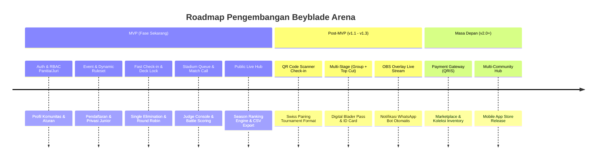

### 7.1 Fitur Wajib MVP (Must-Have Scope)
1. **Autentikasi & RBAC:** Login panitia/juri via Fortify, Spatie Permission (ULID primary keys).
2. **Profil Komunitas:** Informasi komunitas Beyblade Samarinda, aturan umum, kode etik, dan disclaimer legal.
3. **Manajemen Event:** Pembuatan event, banner, lokasi/maps link, status lifecycle event lengkap.
4. **Kategori & Dynamic Ruleset Engine:** Multi-kategori per event, format turnamen, target poin, dan konfigurasi jenis finish fleksibel (tanpa hardcode).
5. **Pendaftaran Blader & Perlindungan Wali:** Form pendaftaran publik, manajemen status pendaftaran, field privat wali untuk peserta junior, persetujuan aturan, dan ekspor data ke CSV.
6. **Registrasi Deck & Deck Lock:** Slot deck sesuai kategori, visibilitas privat/publik, timestamp kunci deck, dan audit log modifikasi.
7. **Check-in Engine:** Layar fast-search, penandaan hadir/no-show, promosi otomatis/manual dari daftar tunggu, dan syarat mutlak masuk bracket.
8. **Single Elimination Engine:** Seeding acak/manual, penanganan bye otomatis, visualisasi bracket interaktif, bracket lock, progresi pemenang otomatis, dan match juara 3 opsional.
9. **Round Robin Engine:** Jadwal putaran otomatis (Berger algorithm), klasemen dinamis, dan kriteria tie-breaker terkonfigurasi.
10. **Stadium & Match Calling:** Manajemen stadium, penugasan juri, antrean panggilan match, dan pencegahan bentrok jadwal blader.
11. **Judge Console & Pencatatan Battle:** Input battle mobile-friendly, pemilihan finish type, akumulasi skor otomatis, penalti, draw/rematch, walkover, dispute flag, dan submission idempotent.
12. **Halaman Publik & Live Hub:** Tampilan publik tanpa login untuk bracket, klasemen, call board stadium, dan detail match (aman dari kebocoran data pribadi).
13. **Ranking Komunitas & Musim:** Musim ranking, formula poin berversi, kalkulasi ulang deterministik, dan leaderboard publik.
14. **Dashboard Operasional Panitia:** Pantauan real-time progress pendaftaran, check-in, status stadium, dan log aktivitas turnamen.
15. **Audit Log:** Pencatatan perubahan penting (role, deck lock, bracket regen, koreksi skor, ranking) menggunakan Spatie Activitylog.
16. **Ekspor Data:** Ekspor data peserta, hasil turnamen, dan klasemen ranking ke CSV/XLSX menggunakan Maatwebsite Excel.

### 7.2 Roadmap Pasca-MVP (Post-MVP Backlog)
- Format turnamen **Swiss System** & **Multi-Stage** (Group Stage dilanjutkan Top Cut Single Elimination).
- **Check-in mandiri via QR Code** scanner di meja registrasi.
- **Portal mandiri Blader:** Akun blader untuk menyimpan riwayat combo, grafik performa, dan profil publik.
- **Sertifikat & Kartu Blader Digital:** Generator kartu Blader ID dan e-sertifikat juara (PDF/PNG).
- **OBS Real-time Overlay:** URL khusus untuk overlay broadcast live stream (YouTube/Twitch) yang menampilkan nama pemain, skor live, dan grafik animasi finish.
- **Integrasi WhatsApp Gateway:** Notifikasi otomatis ke nomor peserta/wali saat dipanggil ke stadium.
- **Payment Gateway Pendaftaran:** Integrasi QRIS otomatis via Midtrans/Xendit untuk pembayaran biaya partisipasi.
- **Multi-Community SaaS:** Arsitektur multi-tenant untuk komunitas kota lain di Kalimantan dan seluruh Indonesia.

---

## 8. Functional Requirements (FR)

### 8.1 Autentikasi, Role, dan Profil Komunitas
- **`FR-001` — Manajemen Akun & Autentikasi Panitia:** Sistem harus mengautentikasi panitia dan juri menggunakan Laravel Fortify dengan fitur login, rate limiting (5 percobaan/menit), reset password, 2FA opsional, dan session handling di database.
- **`FR-002` — Role-Based Access Control (RBAC):** Sistem harus menerapkan RBAC menggunakan Spatie Laravel Permission dengan role: `Community Admin`, `Organizer`, dan `Judge`. Setiap endpoint mutlak diverifikasi di sisi server (Server-Side Policy/Middleware).
- **`FR-003` — Profil Komunitas & Kode Etik:** Sistem harus menyediakan pengelolaan profil Komunitas Beyblade Samarinda yang mencakup nama, deskripsi, tautan media sosial, kontak resmi, aturan umum komunitas, pedoman sportivitas, dan teks disclaimer non-afiliasi resmi.
- **`FR-004` — Audit Logging Sistem:** Sistem harus mencatat seluruh aktivitas administratif dan perubahan data kritis ke dalam tabel `activity_log` dengan relasi ULID dan detail perubahan atribut (sebelum vs sesudah).

### 8.2 Manajemen Event dan Kategori
- **`FR-005` — Siklus Hidup Event (Event Lifecycle):** Sistem harus mendukung siklus hidup event dengan state: `Draft`, `Published`, `Registration Open`, `Registration Closed`, `Check-in`, `Ongoing`, `Completed`, `Archived`, dan jalur `Cancelled`.
- **`FR-006` — Metadata & Informasi Event:** Event harus menyimpan nama event, tanggal & jam pelaksanaan (WITA), nama venue, alamat lengkap, tautan Google Maps, biaya pendaftaran (informasional), kontak narahubung panitia, kuota total peserta, URL poster/banner, serta pengumuman penting.
- **`FR-007` — Manajemen Multi-Kategori Turnamen:** Satu event dapat memiliki satu atau lebih kategori (misalnya: *Open B4*, *Junior Under-12*, *3on3 Beyblade X Deck*, *Classic Burst*). Setiap kategori memiliki kuota terpisah, batas usia opsional, dan label sistem/generasi.
- **`FR-008` — Eligibility Ranking Event:** Admin/Organizer dapat menandai apakah suatu event/kategori berkontribusi terhadap ranking musim komunitas (`is_ranking_eligible = true/false`).

### 8.3 Ruleset Engine Dinamis (Tanpa Hardcode)
- **`FR-009` — Konfigurasi Jenis Finish & Nilai Poin:** Setiap kategori turnamen wajib memiliki konfigurasi jenis finish yang fleksibel. Sistem tidak boleh melakukan hardcode jenis finish global. Contoh konfigurasi default:
  - *Spin Finish*: 1 Poin
  - *Over Finish*: 2 Poin
  - *Burst Finish*: 2 Poin
  - *Xtreme Finish*: 3 Poin
  - *Penalti Lawan*: 1 Poin
- **`FR-010` — Format Pertandingan & Target Poin Kemenangan:** Kategori harus menentukan kriteria kemenangan match:
  - Berdasarkan akumulasi poin (contoh: *First to 4 points* / *Target 4 Poin*); ATAU
  - Berdasarkan jumlah battle (contoh: *Best of 3 battles*).
- **`FR-011` — Snapshot Ruleset pada Match:** Saat match dibuat atau dijalankan, snapshot ruleset kategori harus disimpan langsung ke dalam record match/kategori. Perubahan ruleset global di masa depan tidak boleh mengubah riwayat penilaian match lampau.
- **`FR-012` — Immutability Aturan Aktif:** Sistem wajib menolak perubahan aturan penilaian/skor pada suatu kategori jika sudah ada minimal satu match dalam kategori tersebut yang statusnya bukan `Scheduled`.

### 8.4 Pendaftaran Blader & Perlindungan Peserta Junior
- **`FR-013` — Form Pendaftaran Publik (Guest-Friendly):** Sistem menyediakan form pendaftaran publik tanpa mewajibkan pendaftar membuat akun login. Form meminta: Nama Panggilan/Nickname, Nama Lengkap (privat), Nomor Kontak/WhatsApp (privat), Tanggal Lahir/Usia (privat), Kategori yang diikuti, dan data combo/deck (jika diwajibkan).
- **`FR-014` — Perlindungan Data Peserta Junior & Guardian:** Jika peserta tergolong junior (misal usia < 13 tahun atau kategori Junior), form mewajibkan pengisian Data Wali: Nama Orang Tua/Wali, Nomor Kontak Wali, dan Hubungan Keluarga. Data ini bersifat **STRICTLY PRIVATE** dan hanya dapat diakses oleh role `Community Admin` dan `Organizer`.
- **`FR-015` — Persetujuan Terpisah (Explicit Consents):** Pendaftaran mewajibkan checklist persetujuan terpisah:
  1. Persetujuan Aturan Turnamen & Sportivitas (Wajib);
  2. Persetujuan Pemrosesan Data & Privasi Komunitas (Wajib);
  3. Persetujuan Dokumentasi Foto/Video Kegiatan (Wajib/Opsional).
- **`FR-016` — Manajemen Status Pendaftaran & Input Manual Panitia:** Pendaftaran memiliki status: `Pending`, `Approved`, `Waitlisted`, `Rejected`, `Withdrawn`. Panitia dapat menambahkan peserta secara manual di lokasi (walk-in registration on-site).

### 8.5 Registrasi Combo/Deck dan Deck Lock
- **`FR-017` — Konfigurasi Slot Deck:** Kategori turnamen dapat mengaktifkan registrasi deck dengan menentukan jumlah slot (contoh: 1 Bey untuk 1on1, 3 Bey untuk format 3on3). Masing-masing slot menampung rincian part (misal: Blade, Ratchet, Bit untuk Beyblade X).
- **`FR-018` — Kebijakan Visibilitas Deck:** Deck dapat diatur visibilitasnya: `private_until_match` (hanya juri dan peserta yang tahu sebelum tanding), `public_after_event` (dibuka untuk umum setelah turnamen selesai), atau `always_private`.
- **`FR-019` — Deck Lock & Exception Override:** Deck peserta dikunci (`is_deck_locked = true`) secara otomatis saat check-in selesai atau turnamen dimulai. Setiap perubahan combo setelah lock hanya dapat dilakukan oleh Organizer/Admin dengan menyertakan alasan tertulis (contoh: "Part rusak/pecah saat battle") dan dicatat di audit log.

### 8.6 Check-in Engine
- **`FR-020` — Fast-Search Check-in Venue:** Layar khusus panitia di meja registrasi untuk mencari peserta dengan cepat berdasarkan nama, nickname, atau nomor registrasi.
- **`FR-021` — Status Check-in & No-Show:** Panitia dapat menandai peserta sebagai `Checked-in` atau `No-show`.
- **`FR-022` — Promosi Waitlist Otomatis/Manual:** Jika ada peserta yang berstatus `Withdrawn` atau `No-show` sebelum bracket dibuat, panitia dapat mempromosikan peserta teratas dari daftar `Waitlisted` menjadi `Approved` / `Checked-in`. Hanya peserta dengan status `Checked-in` yang eligible masuk ke pembuatan bracket.

### 8.7 Single Elimination Engine
- **`FR-023` — Generator Bracket Single Elimination:** Sistem menghasilkan bagan eliminasi tunggal dari seluruh peserta berstatus `Checked-in`. Jika jumlah peserta $N \neq 2^k$, sistem secara otomatis menempatkan sejumlah $2^{\lceil \log_2 N \rceil} - N$ peserta berstatus *Bye* pada putaran pertama.
- **`FR-024` — Mode Seeding & Interactive Preview:** Mendukung metode *Random Seeding* atau *Manual Seeding* (berdasarkan ranking musim). Panitia dapat melihat pratinjau (preview) bagan interaktif sebelum menguncinya.
- **`FR-025` — Bracket Lock & Progresi Otomatis:** Setelah bracket dikunci (`bracket_locked = true`), pemenang dari setiap match yang selesai secara otomatis dipromosikan mengisi slot match di putaran berikutnya.
- **`FR-026` — Perebutan Juara 3 (Third Place Play-off):** Tersedia opsi konfigurasi perebutan posisi ketiga untuk mempertemukan dua peserta yang kalah di babak semifinal.

### 8.8 Round Robin Engine
- **`FR-027` — Generator Jadwal Round Robin:** Sistem menyusun jadwal pertandingan satu putaran penuh menggunakan algoritma Berger / Circle Method, memastikan setiap peserta bertanding tepat satu kali melawan semua peserta lain dalam grup/kategori.
- **`FR-028` — Klasemen Dinamis (Standings):** Klasemen dihitung otomatis dengan kolom: Main ($MP$), Menang ($W$), Seri ($D$), Kalah ($L$), Poin Match ($Pts$), Poin Battle Menang ($BP+$), Poin Battle Kalah ($BP-$), Selisih Poin Battle ($\Delta BP$).
- **`FR-029` — Konfigurasi Aturan Tie-Breaker:** Sistem menentukan peringkat klasemen berdasarkan urutan prioritas yang dapat dikonfigurasi per kategori:
  1. Match Points;
  2. Head-to-Head;
  3. Selisih Poin Battle ($\Delta BP$);
  4. Total Poin Battle ($BP+$);
  5. Jumlah Pelanggaran/Penalti Paling Sedikit;
  6. Match Playoff / Coin Toss.

### 8.9 Manajemen Stadium dan Pemanggilan Match (Match Calling)
- **`FR-030` — Registry Stadium Komunitas:** Pengelolaan daftar stadium (contoh: *Stadium Beystadium A*, *Stadium Xtreme B*, *Stadium C*), lengkap dengan status: `Available`, `In Use`, `Maintenance`.
- **`FR-031` — Penugasan Juri:** Organizer dapat menugaskan juri tertentu ke stadium atau ke match tertentu. Juri hanya dapat menginput hasil pada match yang ditugaskan kepadanya.
- **`FR-032` — Antrean & Panggilan Pertandingan (Match Queue):** Match memiliki status: `Scheduled` $\to$ `Called` $\to$ `Ready` $\to$ `Live` $\to$ `Completed`. Papan panggil visual menampilkan match yang sedang berlangsung dan match berikutnya.
- **`FR-033` — Pencegahan Bentrok Jadwal (Conflict Prevention):** Sistem mendeteksi dan mencegah pemanggilan match jika salah satu Blader sedang aktif bertanding di stadium lain (`Called`/`Ready`/`Live`).

### 8.10 Judge Console & Pencatatan Skor Battle
- **`FR-034` — Antarmuka Juri Mobile-First:** Antarmuka khusus smartphone dengan elemen UI sentuh berukuran besar, kontras tinggi, dan minim distraksi untuk juri di pinggir stadium.
- **`FR-035` — Pencatatan Battle Dinamis:** Juri mencatat setiap ronde (battle): memilih pemenang ronde, memilih jenis finish dari daftar ruleset (Spin, Over, Burst, Xtreme, Penalti), atau menandai Draw/Rematch.
- **`FR-036` — Deteksi Kemenangan Match Otomatis:** Sistem secara otomatis menjumlahkan poin battle. Begitu target poin kategori tercapai, UI menampilkan notifikasi kemenangan dan mengunci tombol ronde.
- **`FR-037` — Penanganan Walkover & Penalti:** Juri dapat mencatat penalti/kartu teguran atau memicu Walkover (WO) jika lawan tidak hadir setelah batas waktu panggilan habis.
- **`FR-038` — Alur Dispute & Resolusi:** Jika terjadi sengketa, juri dapat menandai match sebagai `Disputed` disertai catatan kronologi. Organizer/Head Judge dapat meninjau dan menyelesaikan dispute.
- **`FR-039` — Idempotency & Ketahanan Jaringan Venue:** Pengiriman data battle menyertakan `client_request_id` / battle index untuk mencegah duplikasi catatan jika juri menekan tombol berulang kali saat koneksi lambat. UI menyediakan indikator status sinkronisasi.

### 8.11 Halaman Publik & Live Hub
- **`FR-040` — Live Bracket & Klasemen Publik:** Halaman publik yang dapat diakses siapa saja tanpa login, menampilkan bracket eliminasi interaktif, klasemen round robin, papan panggilan stadium, dan detail match yang sedang berjalan.
- **`FR-041` — Sanitasi Data Publik (Privacy Guarantee):** Endpoint dan tampilan publik HANYA menampilkan `nickname` / `display_name`, nomor seed, dan data skor. Nama asli, tanggal lahir, kontak, dan data wali TIDAK PERNAH dikirim dalam response data publik.
- **`FR-042` — Pembaruan Real-Time & Fallback Polling:** Halaman publik menerima update skor dan status match secara real-time via Laravel Reverb. Jika koneksi WebSocket terputus, sistem beralih ke interval polling otomatis setiap 10–15 detik.
- **`FR-043` — Podium & Pengumuman Juara:** Halaman rangkuman event menampilkan Juara 1, Juara 2, Juara 3, dan Top 4/Top 8 lengkap dengan ringkasan statistik.

### 8.12 Ranking Komunitas dan Musim
- **`FR-044` — Manajemen Musim Komunitas (Seasons):** Admin dapat membuat dan mengelola musim kompetisi (contoh: *Musim Samarinda 2026 Q1*, *Liga Tahunan 2026*).
- **`FR-045` — Formula Poin Berversi (Versioned Formula):** Perhitungan ranking menggunakan formula modular yang memiliki versi (contoh: `formula_version = "v1.0-2026"`). Parameter formula mencakup poin partisipasi, poin penempatan juara (1st, 2nd, 3rd, Top 8), bobot tier event, dan poin kemenangan match.
- **`FR-046` — Kalkulasi Ulang Deterministik:** Admin dapat memicu kalkulasi ulang poin seluruh musim secara deterministik dan idempotent melalui dashboard atau Artisan command.
- **`FR-047` — Penyesuaian Manual Berbasis Audit:** Setiap koreksi manual terhadap poin ranking peserta wajib menyertakan alasan tertulis dan tersimpan permanen di audit log.

### 8.13 Dashboard Operasional, Audit, dan Ekspor
- **`FR-048` — Dashboard Operasional Panitia:** Menampilkan statistik ringkas: total pendaftar, jumlah check-in, stadium aktif, match live, antrean dispute, dan progres penyelesaian kategori turnamen.
- **`FR-049` — Ekspor Data CSV/XLSX:** Fitur ekspor menggunakan Maatwebsite Excel untuk:
  1. Daftar pendaftaran peserta turnamen (lengkap dengan status dan data kontak untuk panitia berwenang);
  2. Hasil seluruh match dan battle turnamen;
  3. Klasemen leaderboard ranking musim komunitas.
- **`FR-050` — Viewer Audit Log:** Tampilan riwayat audit log untuk Community Admin guna memeriksa siapa yang mengubah role, mengubah deck setelah lock, meregenerasi bracket, atau mengoreksi skor pertandingan.

---

## 9. User Flow Utama

### 9.1 Flow 1: Setup Event & Kategori (Organizer / Admin)

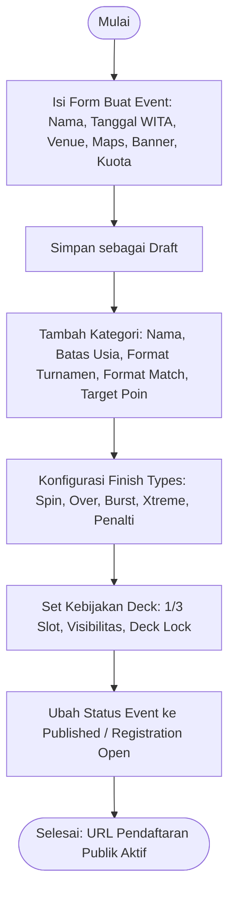

### 9.2 Flow 2: Pendaftaran Blader & Validasi Wali (Blader / Guardian)

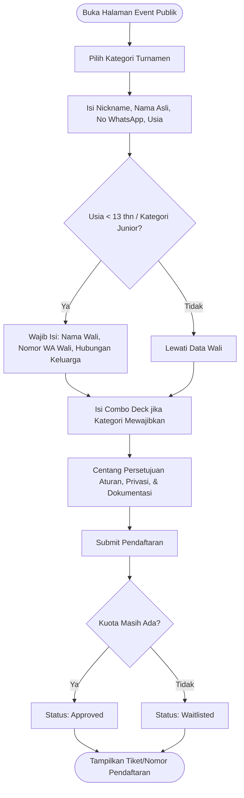

### 9.3 Flow 3: Hari-H Check-in, Waitlist Resolution & Deck Lock

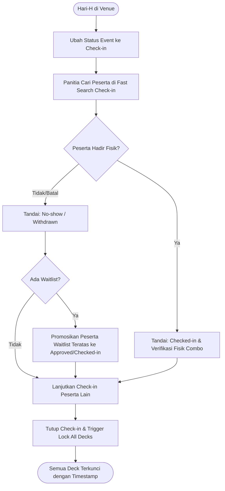

### 9.4 Flow 4: Bracket Generation & Bracket Lock (Organizer)

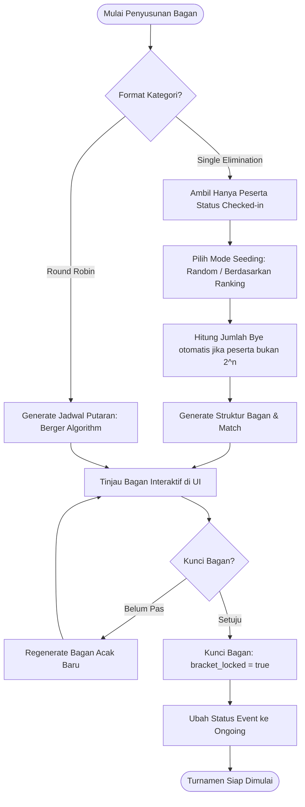

### 9.5 Flow 5: Match Calling & Stadium Queue (Organizer / Judge)

```mermaid
flowchart TD
    StartCall([Cek Daftar Match Siap Panggil]) --> PickMatch[Pilih Match status Scheduled]
    PickMatch --> CheckConflict{Apakah Blader 1 atau Blader 2 sedang tanding di Stadium lain?}
    CheckConflict -- Ya (Bentrok) --> AlertConflict[Peringatan: Blader sedang bertanding di Stadium X, tunda panggilan]
    CheckConflict -- Tidak (Aman) --> PickStadium[Pilih Stadium Kosong (Status: Available)]
    PickStadium --> AssignJudge[Pilih Juri Bertugas]
    AssignJudge --> TriggerCall[Ubah Status Match ke Called]
    TriggerCall --> BroadcastCall[Papan Panggilan Publik Real-time menampilkan: Blader A vs Blader B di Stadium 1]
    BroadcastCall --> CheckArrival{Kedua Blader Tiba di Stadium?}
    CheckArrival -- Ya (< 3 Menit) --> SetReady[Juri Set Status: Ready -> Live]
    CheckArrival -- Tidak (> 3 Menit) --> TriggerWO[Juri/Panitia Eksekusi Walkover]
    SetReady --> EndCall([Battle Dimulai di Stadium])
    TriggerWO --> EndCall
```

### 9.6 Flow 6: Pencatatan Battle di Judge Console (Judge)

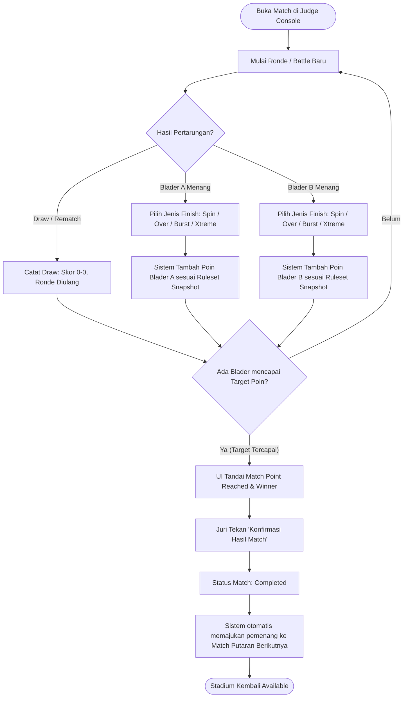

### 9.7 Flow 7: Dispute Resolution & Koreksi Skor Aman

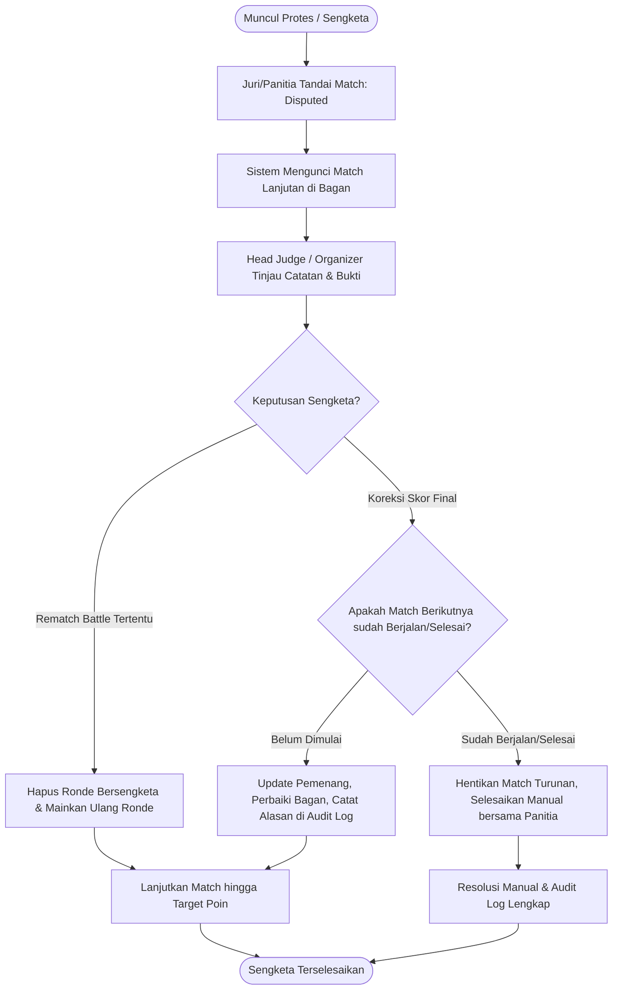

### 9.8 Flow 8: Finalisasi Event, Podium & Update Ranking Musim

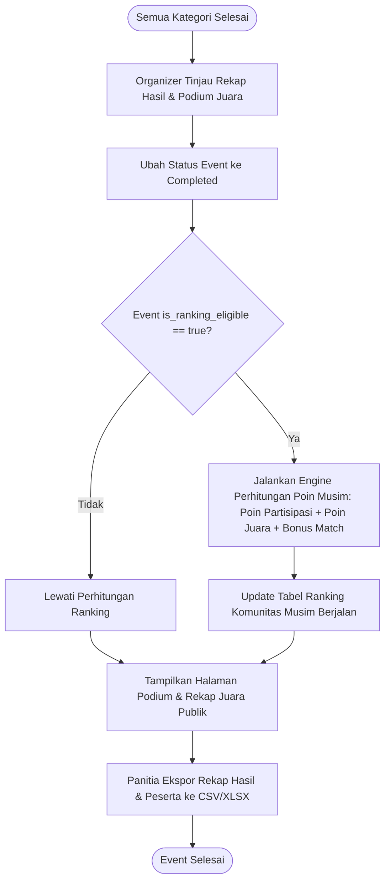

---

## 10. Aturan Bisnis dan Domain Rules

1. **Aturan Scoring Engine Dinamis:**
   - Jenis finish dan nilai poin TIDAK BOLEH di-hardcode di kode aplikasi.
   - Nilai poin finish harus integer positif $\ge 1$.
   - Skor penalti diberikan ke lawan atau mengurangi poin pelanggar sesuai konfigurasi ruleset.
2. **Kondisi Selesai Match (Match Termination):**
   - Match dinyatakan selesai jika salah satu peserta telah mengumpulkan total poin $\ge \text{target\_points}$ kategori, ATAU telah memenangkan jumlah battle sesuai format *Best of X*.
   - Hasil pertandingan bersifat final setelah tombol konfirmasi ditekan oleh juri dan tidak ada status *Disputed*.
3. **Immutability Ruleset Kategori:**
   - Dilarang keras mengedit ruleset skor pada kategori yang turnamennya telah dimulai (terdapat match dengan status bukan `Scheduled`).
4. **Bracket Integrity & Safe Regeneration:**
   - Bracket yang belum dimulai dapat dibuat ulang (*regenerate*) secara bebas oleh Organizer.
   - Bracket yang sudah memiliki match berstatus `Live` atau `Completed` DILARANG diregenerate secara langsung. Jika terpaksa dilakukan (force reset), sistem mewajibkan: input teks konfirmasi persetujuan, input alasan tertulis, otorisasi `Community Admin`, dan pencatatan riwayat di audit log.
5. **Koreksi Skor Downstream (Downstream Match Safety):**
   - Jika hasil skor match diperbaiki panitia setelah selesai:
     - Jika match lanjutan berikutnya masih berstatus `Scheduled`, sistem otomatis menukar peserta pemenang pada match lanjutan.
     - Jika match lanjutan berikutnya sudah `Live` atau `Completed`, sistem DILARANG menukar peserta diam-diam; sistem harus menandai cabang bracket tersebut sebagai `Disputed` untuk intervensi manual Head Judge.
6. **Deck Lock Compliance:**
   - Deck terkunci memiliki `locked_at` timestamp.
   - Perubahan combo setelah deck terkunci hanya dapat dilakukan jika disetujui panitia dengan alasan part rusak/cacat/ilegal.
   - Keputusan legalitas part fisik Beyblade tetap berada di tangan juri manusia; sistem aplikasi hanya mencatat combo dan status verifikasi.
7. **Ranking Eligibility & Deterministik:**
   - Hanya event/kategori dengan status `Completed` DAN `is_ranking_eligible = true` yang menyumbangkan poin ranking musim.
   - Setiap formula poin memiliki versi (`formula_version`). Jika formula diubah, hasil historis lama tetap dapat direproduksi menggunakan formula snapshot pada musim terkait.
8. **Standar Waktu Aplikasi:**
   - Seluruh waktu disimpan dalam format standard UTC di database (ISO 8601), namun SELURUH tampilan antarmuka dan input form di-render dalam zona waktu **Asia/Makassar (WITA, UTC+8)**.
9. **Dukungan Guest Blader & Account Linking:**
   - Blader tidak diwajibkan memiliki akun login untuk berkompetisi.
   - Panitia dapat menautkan identitas guest blader ke akun User terdaftar sewaktu-waktu tanpa merusak riwayat pertandingan terdahulu.
10. **Sanitasi PII Ketat:**
    - Field nama lengkap, nomor WhatsApp, tanggal lahir, dan identitas wali tidak boleh dimasukkan ke dalam model/resource serialization yang dikirim ke komponen Inertia publik atau API publik.

---

## 11. State Machine & Lifecycle Transitions

### 11.1 State Machine: Event

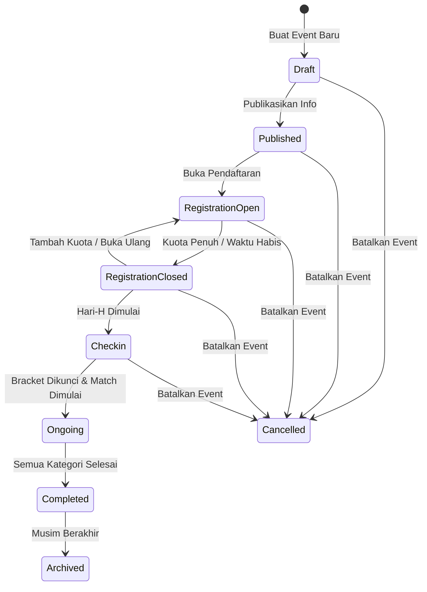

### 11.2 State Machine: Pendaftaran (Registration)

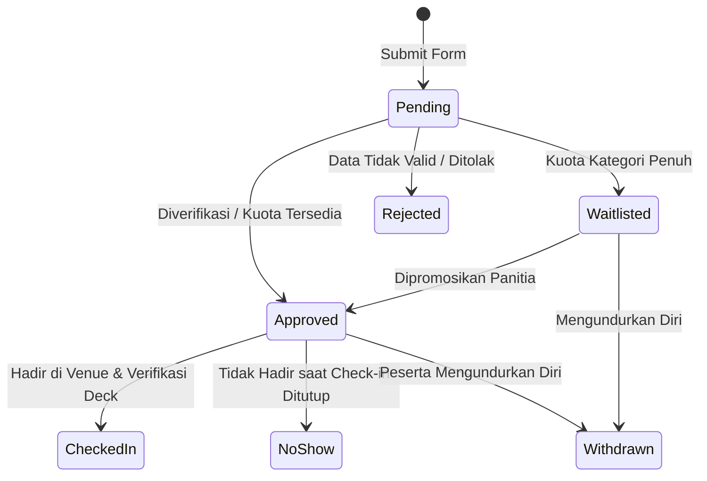

### 11.3 State Machine: Pertandingan (Tournament Match)

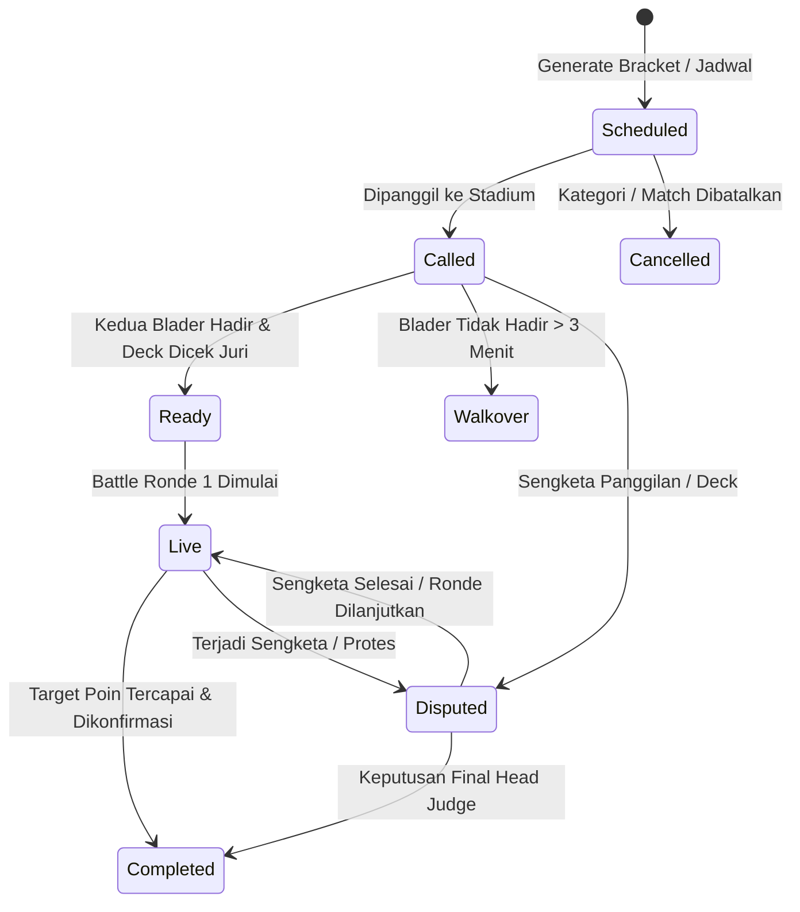

### 11.4 State Machine: Deck / Combo

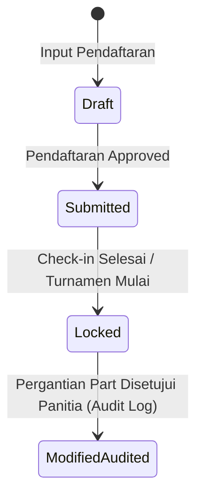

---

## 12. Matriks Role dan Permission (RBAC Matrix)

Sistem menggunakan **Spatie Laravel Permission** dengan ULID sebagai identifier. Matriks hak akses didefinisikan sebagai berikut:

| Modul / Kemampuan | Permission Name | Community Admin | Tournament Organizer | Judge / Juri | Blader / Guardian | Public / Spectator |
| --- | --- | :---: | :---: | :---: | :---: | :---: |
| **Kelola Profil Komunitas** | `community.update` | ✅ | ❌ | ❌ | ❌ | ❌ |
| **Kelola Role & User Admin** | `user.manage_roles` | ✅ | ❌ | ❌ | ❌ | ❌ |
| **Lihat Audit Log** | `audit.view` | ✅ | ❌ | ❌ | ❌ | ❌ |
| **Buat / Edit Musim Ranking** | `season.manage` | ✅ | ❌ | ❌ | ❌ | ❌ |
| **Kalkulasi Ulang Ranking** | `ranking.recalculate` | ✅ | ❌ | ❌ | ❌ | ❌ |
| **Buat / Edit / Hapus Event** | `event.create`, `event.update` | ✅ | ✅ | ❌ | ❌ | ❌ |
| **Kelola Kategori & Ruleset** | `category.manage` | ✅ | ✅ | ❌ | ❌ | ❌ |
| **Lihat Data Privat Pendaftar** | `registration.view_private`| ✅ | ✅ | ❌ | ❌ | ❌ |
| **Check-in Peserta & Edit Status**| `registration.checkin` | ✅ | ✅ | ❌ | ❌ | ❌ |
| **Generate & Kunci Bracket** | `bracket.manage` | ✅ | ✅ | ❌ | ❌ | ❌ |
| **Kelola Stadium & Match Calling**| `stadium.call_match` | ✅ | ✅ | ❌ | ❌ | ❌ |
| **Input Skor Battle & Finish** | `match.score_input` | ✅ | ✅ | ✅ *(Assigned)*| ❌ | ❌ |
| **Verifikasi Deck di Stadium** | `deck.verify` | ✅ | ✅ | ✅ | ❌ | ❌ |
| **Override Deck setelah Lock** | `deck.override_locked` | ✅ | ✅ | ❌ | ❌ | ❌ |
| **Eksekusi Walkover / Dispute**| `match.dispute_resolve` | ✅ | ✅ | ⚠️ *(Flag only)*| ❌ | ❌ |
| **Ekspor CSV Peserta/Hasil** | `data.export` | ✅ | ✅ | ❌ | ❌ | ❌ |
| **Daftar Turnamen (Form Publik)**| `public.register` | ✅ | ✅ | ✅ | ✅ | ✅ |
| **Lihat Live Hub / Standings** | `public.view_live` | ✅ | ✅ | ✅ | ✅ | ✅ |

---

## 13. Model Data Konseptual dan Relasi Database

Semua model menggunakan trait `App\Concerns\HasUlids` untuk primary key 26 karakter string (`id`), relasi menggunakan `foreignUlid()`, serta memanfaatkan `Spatie\Activitylog\Traits\LogsActivity`.

### 13.1 Entity Relationship Diagram (ERD)

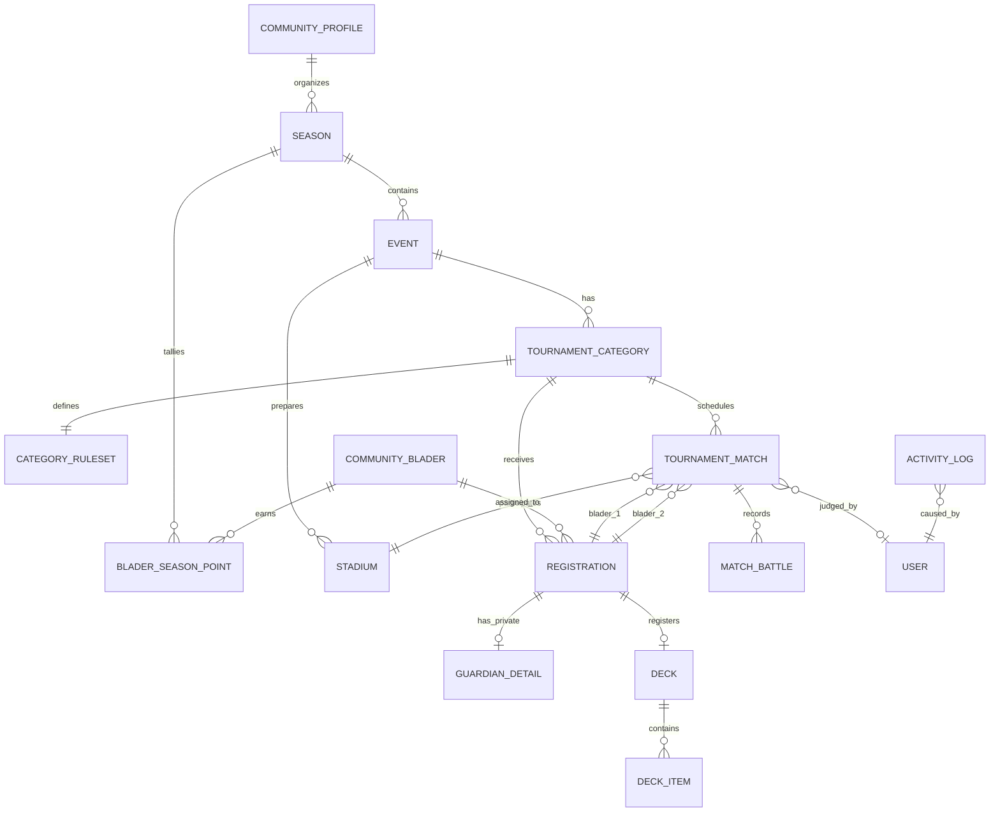

### 13.2 Rincian Tabel & Skema Database

#### 1. `community_profiles`
- `id` (ULID, PK)
- `name` (string, contoh: "Komunitas Beyblade Samarinda")
- `tagline` (string, contoh: "Putar, tanding, jadi juara.")
- `description` (text)
- `logo_path` (string, nullable)
- `contact_email` (string, nullable)
- `contact_whatsapp` (string, nullable)
- `social_links` (json: instagram, facebook, youtube, discord)
- `general_rules` (longText)
- `code_of_conduct` (longText)
- `disclaimer_text` (text)
- `created_at`, `updated_at` (timestamps)

#### 2. `seasons`
- `id` (ULID, PK)
- `name` (string, contoh: "Musim Kompetisi Samarinda 2026")
- `slug` (string, unique)
- `start_date` (date)
- `end_date` (date)
- `status` (enum: `draft`, `active`, `concluded`, `archived`)
- `formula_version` (string, default: "v1.0")
- `formula_config` (json: tier_multipliers, placement_points, win_bonus)
- `created_at`, `updated_at` (timestamps)

#### 3. `events`
- `id` (ULID, PK)
- `season_id` (ULID, FK `seasons.id`, nullable)
- `title` (string)
- `slug` (string, unique)
- `description` (text, nullable)
- `banner_path` (string, nullable)
- `event_date` (datetime, disimpan UTC, ditampilkan WITA)
- `venue_name` (string, contoh: "Atrium Mall Lembuswana Samarinda")
- `venue_address` (text)
- `maps_url` (string, nullable)
- `registration_fee_info` (string, nullable, contoh: "Gratis / Rp 25.000 (Bayar on-site)")
- `contact_person` (string, nullable)
- `status` (enum: `draft`, `published`, `registration_open`, `registration_closed`, `checkin`, `ongoing`, `completed`, `archived`, `cancelled`)
- `is_ranking_eligible` (boolean, default: true)
- `max_participants` (integer, nullable)
- `announcement` (text, nullable)
- `created_at`, `updated_at` (timestamps)

#### 4. `tournament_categories`
- `id` (ULID, PK)
- `event_id` (ULID, FK `events.id`)
- `name` (string, contoh: "Open B4 Beyblade X", "Junior U-12")
- `generation_system` (string, contoh: "Beyblade X", "Burst", "Classic")
- `min_age` (integer, nullable)
- `max_age` (integer, nullable)
- `tournament_format` (enum: `single_elimination`, `round_robin`)
- `match_format` (enum: `first_to_points`, `best_of_battles`)
- `target_points` (integer, default: 4)
- `best_of_battles_count` (integer, nullable)
- `deck_slots_count` (integer, default: 3)
- `allow_combo_change` (boolean, default: false)
- `deck_visibility` (enum: `private_until_match`, `public_after_event`, `always_private`, `always_public`)
- `has_third_place_match` (boolean, default: true)
- `max_participants` (integer, nullable)
- `status` (enum: `pending`, `ready`, `in_progress`, `completed`)
- `ruleset_snapshot` (json)
- `bracket_locked` (boolean, default: false)
- `bracket_locked_at` (timestamp, nullable)
- `created_at`, `updated_at` (timestamps)

#### 5. `community_bladers`
- `id` (ULID, PK)
- `user_id` (ULID, FK `users.id`, nullable)
- `nickname` (string, index)
- `slug` (string, unique)
- `full_name` (string, **PII**, hidden)
- `phone` (string, nullable, **PII**, hidden)
- `birth_date` (date, nullable, **PII**, hidden)
- `avatar_path` (string, nullable)
- `is_verified` (boolean, default: false)
- `created_at`, `updated_at` (timestamps)

#### 6. `registrations`
- `id` (ULID, PK)
- `event_id` (ULID, FK `events.id`)
- `tournament_category_id` (ULID, FK `tournament_categories.id`)
- `community_blader_id` (ULID, FK `community_bladers.id`)
- `registration_number` (string, unique)
- `display_name` (string)
- `seed_number` (integer, nullable)
- `status` (enum: `pending`, `approved`, `waitlisted`, `rejected`, `withdrawn`, `checked_in`, `no_show`)
- `is_deck_locked` (boolean, default: false)
- `deck_locked_at` (timestamp, nullable)
- `checked_in_at` (timestamp, nullable)
- `checked_in_by` (ULID, FK `users.id`, nullable)
- `consent_rules` (boolean, default: true)
- `consent_privacy` (boolean, default: true)
- `consent_media` (boolean, default: true)
- `created_at`, `updated_at` (timestamps)

#### 7. `guardian_details` (Strictly 1:1 Private)
- `id` (ULID, PK)
- `registration_id` (ULID, FK `registrations.id`, unique)
- `guardian_name` (string, **PII**)
- `guardian_phone` (string, **PII**)
- `guardian_relationship` (string, **PII**, contoh: "Ayah", "Ibu", "Paman")
- `notes` (text, nullable)
- `created_at`, `updated_at` (timestamps)

#### 8. `decks` & `deck_items`
- `decks`: `id` (ULID, PK), `registration_id` (ULID, FK), `is_locked` (boolean), `locked_at` (timestamp), `override_reason` (text, nullable), `timestamps`
- `deck_items`: `id` (ULID, PK), `deck_id` (ULID, FK), `slot_number` (integer 1..3), `blade_name` (string), `ratchet_name` (string), `bit_name` (string), `launcher_type` (string, nullable), `weight_gram` (decimal 5,2, nullable), `notes` (string, nullable), `timestamps`

#### 9. `stadiums`
- `id` (ULID, PK)
- `event_id` (ULID, FK `events.id`)
- `name` (string, contoh: "Stadium A - Extreme Arena")
- `code` (string, contoh: "ST-A")
- `type` (string, default: "Standard Xtreme Stadium")
- `status` (enum: `available`, `in_use`, `maintenance`)
- `created_at`, `updated_at` (timestamps)

#### 10. `tournament_matches`
- `id` (ULID, PK)
- `tournament_category_id` (ULID, FK `tournament_categories.id`)
- `round_number` (integer)
- `match_number` (integer)
- `round_name` (string, contoh: "Babak 1", "Perempat Final", "Semifinal", "Final", "Perebutan Juara 3")
- `bracket_position` (string, nullable, contoh: "R1-M1")
- `blader_1_id` (ULID, FK `registrations.id`, nullable)
- `blader_2_id` (ULID, FK `registrations.id`, nullable)
- `winner_id` (ULID, FK `registrations.id`, nullable)
- `loser_id` (ULID, FK `registrations.id`, nullable)
- `score_blader_1` (integer, default: 0)
- `score_blader_2` (integer, default: 0)
- `status` (enum: `scheduled`, `called`, `ready`, `live`, `completed`, `walkover`, `disputed`, `cancelled`)
- `stadium_id` (ULID, FK `stadiums.id`, nullable)
- `judge_id` (ULID, FK `users.id`, nullable)
- `called_at` (timestamp, nullable)
- `started_at` (timestamp, nullable)
- `completed_at` (timestamp, nullable)
- `dispute_reason` (text, nullable)
- `dispute_resolved_by` (ULID, FK `users.id`, nullable)
- `ruleset_snapshot` (json)
- `next_match_id` (ULID, nullable)
- `next_loser_match_id` (ULID, nullable)
- `created_at`, `updated_at` (timestamps)

#### 11. `match_battles`
- `id` (ULID, PK)
- `tournament_match_id` (ULID, FK `tournament_matches.id`)
- `battle_number` (integer)
- `winner_registration_id` (ULID, FK `registrations.id`, nullable)
- `finish_type_code` (string, contoh: "spin_finish", "over_finish", "burst_finish", "xtreme_finish", "penalty", "draw")
- `points_awarded` (integer, default: 0)
- `penalty_blader_id` (ULID, FK `registrations.id`, nullable)
- `is_draw` (boolean, default: false)
- `notes` (string, nullable)
- `created_at`, `updated_at` (timestamps)

#### 12. `blader_season_points`
- `id` (ULID, PK)
- `season_id` (ULID, FK `seasons.id`)
- `community_blader_id` (ULID, FK `community_bladers.id`)
- `total_points` (integer, default: 0)
- `events_played_count` (integer, default: 0)
- `matches_won_count` (integer, default: 0)
- `matches_lost_count` (integer, default: 0)
- `tournaments_won_count` (integer, default: 0)
- `rank_position` (integer, default: 0)
- `points_breakdown` (json: participation, placement, wins, manual_adjustments)
- `last_calculated_at` (timestamp)
- `created_at`, `updated_at` (timestamps)

---

## 14. Kebutuhan UX, Mobile-First, dan Flaky Connection

### 14.1 Desain Antarmuka Mobile-First
- **Ukuran Target Sentuh:** Semua tombol interaktif pada Judge Console dan Check-in memiliki area sentuh minimum $48 \times 48\text{ px}$.
- **Palet Warna & Kontras Tinggi:** Mode gelap/terang didukung menggunakan Tailwind CSS 4 dengan rasio kontras teks minimum 4.5:1 (WCAG AA) agar tetap terbaca jelas di bawah pencahayaan venue yang bervariasi.
- **Tipografi Jelas:** Font `Instrument Sans` / `Inter` dengan ukuran teks judul besar dan angka skor yang terlihat dari jarak 1 meter.

### 14.2 Penanganan Koneksi Internet Flaky di Venue
1. **Optimistic UI:** Skor battle langsung bertambah di layar smartphone juri seketika saat tombol ditekan tanpa menunggu respons round-trip server.
2. **Idempotent Requests:** Setiap penambahan battle mengirimkan `battle_index` unik dan timestamp. Jika request terkirim ganda akibat retry otomatis juri, server menolak duplikasi dan hanya mengembalikan status terkini.
3. **Status Banner Konektivitas:** Indikator visual di bagian atas Judge Console:
   - 🟢 *Tersinkronisasi (Online)*
   - 🟡 *Mengirim ulang catatan ronde... (Retrying)*
   - 🔴 *Koneksi terputus — data tersimpan di browser*
4. **Collision Detection Juri:** Mencegah dua juri mencatat match yang sama secara bersamaan dengan mekanisme *match assignment lock*.

---

## 15. Keamanan dan Privasi Data (Khusus Peserta Junior)

1. **Prinsip Least Privilege Data:** Data PII anak (nama asli, tanggal lahir, kontak, data wali) dilindungi di tingkat controller dan database query (`makeHidden(['full_name', 'phone', 'birth_date'])`).
2. **Strict Server-Side Authorization:** Semua request Inertia memvalidasi permission via Spatie Policy sebelum mengembalikan prop data. Tidak ada filter yang hanya dilakukan di frontend React.
3. **Public Display Name Rule:** Hanya kolom `display_name` / `nickname` yang diekspos ke tabel publik, live bracket, klasemen, dan leaderboard.
4. **Enkripsi Sesi & Cookie:** Session disimpan di database (`SESSION_DRIVER=database`), password di-hash dengan Bcrypt 12 rounds, cookie sensitif terenkripsi.

---

## 16. Kebutuhan Non-Fungsional (NFR) dan Observability

| Kategori | Parameter | Target Spesifikasi |
| --- | --- | --- |
| **Response Time** | Input Skor Battle Juri | $\le 200\text{ ms}$ (Server Response), instant di UI |
| **Response Time** | Render Live Bracket Publik | $\le 500\text{ ms}$ untuk 64 peserta |
| **Throughput** | Akses Penonton Live Hub | Sanggup menangani $\ge 300$ koneksi penonton simultan via Reverb |
| **Data Integrity** | Konsistensi Bracket & Skor | $0\text{ duplicate battles}$, $0\text{ orphan match progression}$ |
| **Disaster Recovery**| Database Backup | Automated daily backup via SQLite/MySQL dump ke storage object (S3/RustFS) |
| **Observability** | Log Error & Tracing | Laravel Pail untuk monitoring real-time, Spatie Activitylog untuk audit log operasional |

---

## 17. Analytics & Community Metrics (Privacy-Safe)

Sistem melacak metrik operasional komunitas tanpa mengumpulkan data pribadi pelacak pihak ketiga:
1. **Event Growth Metrics:** Jumlah pendaftar per event, tingkat kehadiran (Checked-in vs No-Show %).
2. **Metrik Pertandingan:** Total battle yang dimainkan, rata-rata durasi match per kategori.
3. **Distribusi Finish Type:** Persentase Spin Finish vs Over Finish vs Burst Finish vs Xtreme Finish di komunitas Samarinda (menjadi wawasan tren meta pertarungan).
4. **Efisiensi Stadium:** Utilisasi waktu aktif masing-masing stadium selama turnamen berlangsung.

---

## 18. Metrik Sukses (Success Metrics & KPIs)

| KPI | Target MVP | Cara Pengukuran |
| --- | --- | --- |
| **Waktu Siklus Match** | $\le 4\text{ menit}$ per match (panggilan hingga konfirmasi) | Timestamp `called_at` $\to$ `completed_at` pada database |
| **Tingkat Akurasi Skor** | $100\%$ tanpa kesalahan hitung manual | Nihil keluhan kesalahan akumulasi poin finish |
| **Insiden Kebocoran PII** | $0\text{ Insiden}$ | Audit log & pengujian penetrasi endpoint publik |
| **Kecepatan Rilis Ranking** | Langsung terbit saat event selesai ($< 1\text{ menit}$) | Eksekusi perhitungan otomatis via event listener |
| **Tingkat Adopsi Juri** | $\ge 90\%$ juri mampu mengoperasikan konsol tanpa kendala | Uji coba simulasi pada gathering internal komunitas |

---

## 19. Acceptance Criteria MVP yang Dapat Diuji

1. **AC-01 (Auth & Role):** Pengguna dengan role `Judge` dapat login dan hanya melihat match yang ditugaskan; pengguna tanpa permission `admin.access` tidak dapat membuka halaman `/settings/*`.
2. **AC-02 (Event & Ruleset):** Admin dapat membuat event baru dengan kategori yang memiliki konfigurasi poin kustom (misal: Burst Finish = 3 poin); perubahan tersebut tersimpan dan tercermin saat juri mencatat battle.
3. **AC-03 (Pendaftaran & Privasi):** Pendaftar usia di bawah 13 tahun wajib mengisi data wali; data wali tidak muncul di response API publik `/events/{slug}/bracket` atau `/events/{slug}/participants`.
4. **AC-04 (Fast Check-in & Deck Lock):** Mengubah status peserta menjadi `Checked-in` mengunci combo deck; upaya mengedit combo setelah terkunci menghasilkan error kecuali dilakukan oleh Admin dengan alasan.
5. **AC-05 (Single Elimination Bracket):** Generator bracket dengan 13 peserta checked-in menghasilkan 16 slot bracket dengan tepat 3 bye; pemenang babak 1 otomatis maju ke babak perempat final.
6. **AC-06 (Round Robin Standings):** Kategori 4 peserta menghasilkan 6 match jadwal; klasemen mengurutkan peringkat secara akurat berdasarkan Match Points lalu Head-to-Head dan $\Delta BP$.
7. **AC-07 (Conflict Prevention):** Mencoba memanggil match yang melibatkan Blader A yang sedang berstatus `Live` di Stadium 1 memunculkan notifikasi peringatan dan memblokir panggilan.
8. **AC-08 (Judge Scoring):** Menekan tombol finish 4 kali yang menghasilkan total poin 4 langsung menampilkan banner kemenangan dan menonaktifkan penambahan battle berikutnya.
9. **AC-09 (Season Leaderboard):** Menyelesaikan event yang ranking-eligible secara otomatis memperbarui poin di halaman `/seasons/{slug}/leaderboard`.
10. **AC-10 (Export Data):** Menekan tombol ekspor pada daftar peserta menghasilkan file CSV dengan struktur kolom yang valid sesuai template Maatwebsite Excel.

---

## 20. Risiko dan Mitigasi

| No | Risiko | Tingkat Dampak | Strategi Mitigasi |
| --- | --- | :---: | --- |
| 1 | **Sinyal seluler di venue mall/indoor lemah atau putus-putus.** | Tinggi | Optimistic UI di Judge Console, antrean retry otomatis, serta fallback polling HTTP jika WebSocket Reverb terputus. |
| 2 | **Panitia salah memasukkan hasil match yang sudah selesai.** | Sedang | Fitur koreksi skor dengan dialog konfirmasi, validasi cabang bracket downstream, dan audit log lengkap. |
| 3 | **Peserta mendaftar ganda dengan nomor telepon/nama berbeda.** | Rendah | Validasi unik pada nickname/nama panggilan per kategori dan filter duplikasi pada meja check-in. |
| 4 | **Part combo Beyblade rusak saat pertarungan.** | Sedang | Mekanisme override deck lock oleh Organizer dengan pencatatan part pengganti dan alasan resmi. |
| 5 | **Juri kehabisan baterai smartphone di tengah turnamen.** | Sedang | Hak akses Organizer untuk mengambil alih pencatatan match atau memindahkan tugas juri ke smartphone panitia lain. |

---

## 21. Strategi Rilis dan Peluncuran

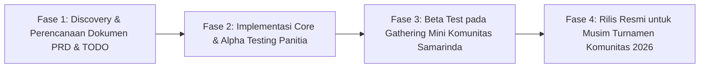

1. **Fase 1 — Discovery & Alignment:** Penyusunan dokumen PRD dan TODO sesuai stack starter kit Laravel + React.
2. **Fase 2 — Alpha Testing (Simulasi Meja Panitia):** Pengujian menyeluruh oleh pengurus komunitas menggunakan data simulasi turnamen 16 & 32 peserta.
3. **Fase 3 — Beta Test Komunitas:** Uji coba lapangan pada 1 event gathering santai komunitas Beyblade di Samarinda untuk memvalidasi konsol juri dan respons penonton.
4. **Fase 4 — Produksi & Musim Liga:** Peluncuran resmi untuk seluruh turnamen berpoin liga Komunitas Beyblade Samarinda.

---

## 22. Pemanfaatan & Penggunaan Ulang Fitur Template Starter Kit

| Komponen / Fitur Template | File / Modul Template | Cara Penggunaan di Beyblade Arena |
| --- | --- | --- |
| **Auth & Security** | `Laravel Fortify`, `app/Models/User.php` | Autentikasi panitia/juri, 2FA, session DB, rate limiting. |
| **RBAC** | `Spatie Permission`, `app/Models/Role.php` | Manajemen role: Community Admin, Organizer, Judge. |
| **ULID Architecture** | `App\Concerns\HasUlids` | Primary key 26 karakter untuk semua entitas turnamen baru. |
| **Audit Logging** | `Spatie Activitylog`, `App\Models\Activity.php` | Pencatatan perubahan role, deck lock, bracket, skor, dan ranking. |
| **Realtime WebSockets**| `Laravel Reverb`, `resources/js/echo.ts` | Broadcast pemanggilan match, skor live, dan update bracket publik. |
| **Export Engine** | `Maatwebsite Excel`, `app/Exports/*` | Ekspor CSV daftar peserta turnamen, rekap hasil, dan klasemen musim. |
| **Design System (COSS)**| `resources/js/components/ui/*` | `Frame`, `Table`, `InputGroup`, `Combobox`, `Badge`, `Dialog`, `Toast`, `Pagination`. |
| **Inertia Form Patterns**| `@inertiajs/react` `<Form>` | Form pendaftaran, form event, form ruleset dengan method patch & render props. |
| **Full-Text Search** | `Laravel Scout` | Pencarian cepat peserta pada layar check-in dan pencarian global. |
| **Testing Suite** | `Pest 4`, `TestingDatabaseGuard` | Test suite otomatis untuk rule engine, bracket progression, dan privasi data. |
